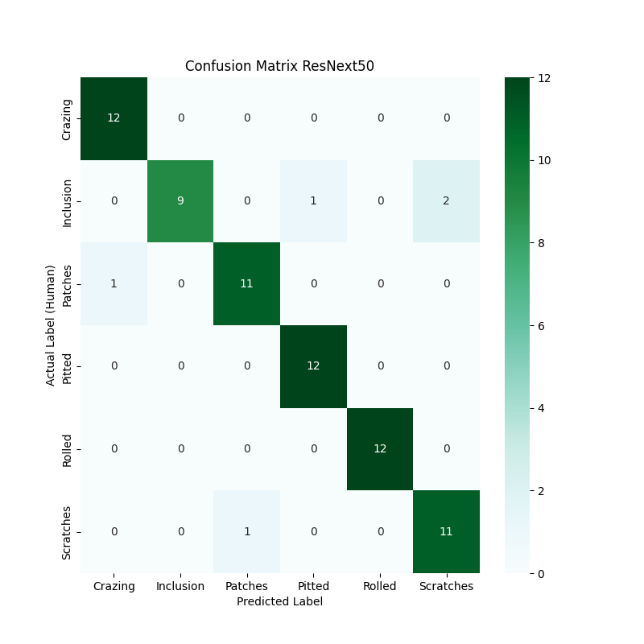
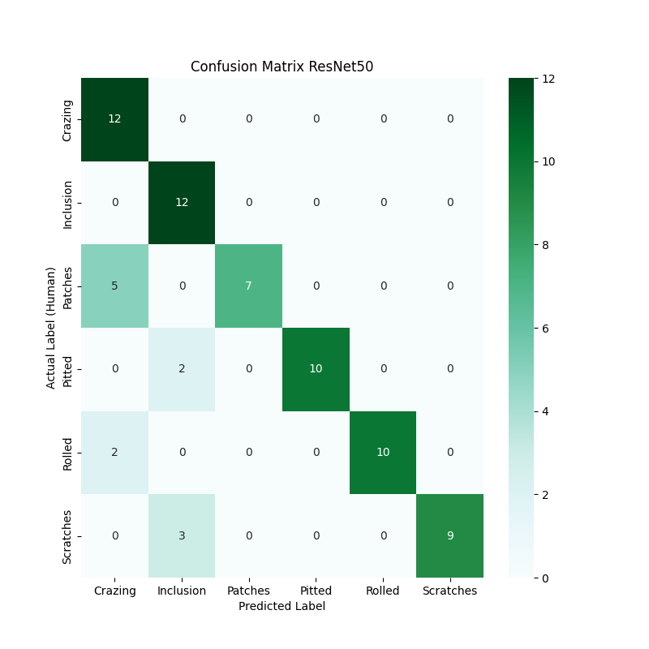

# Steel Defect Detection through Computer Vision
An introductory computor vision project for computer vision defect detection in manufacturing, a field I am interested in.

## Description
This project uses computer vision to predict the type of defect in a series of images containing defects. The can be combined with another technique such as highlighting changes through overlaying an averaged negative of the QC line, in order to detect when a difference occurs. An image of that difference can be forwarded to this model to determine the type of defect. 

# Result
ResNeXt 50 pre-training outperforms ResNet v1.5 at 25 epochs, with less than half the errors, attaining 93% accuracy.

Scratches and patches were the most over-represented (+2) in machine labels, and inclusions were most under-represented (-3).

Crazing, Rolled, and pitting were all 100% correctly identified.

 

# References and Resources

## Dataset Documentation

This dataset contains three folders: train, test, valid. The training folder contains six defect type subfolders that have 276 image files in each folder. The test and validation folders contain six defect type subfolders that have 12 images in each folder.

These 6 defect modes in this dataset are:
* **Inclusion**: A nonuniform material was presssed or forged into the material. They can be loose and easily removed, or very tightly bound.
* **Crazing**: Visible surface cracking, typically many cracks in one region due to tension stresses.
* **Patches**: A patch of nonuniform material
* **Pitting**: Penetrating pockmarks and divots caused by corrosion 
* **Scratches**: Abrasion marking
* **Rolled**: Material that had mill scale pressed into it during the rolling process.

Source: https://www.kaggle.com/datasets/fantacher/neu-metal-surface-defects-data/data

"This dataset was downloaded from the NEU Metal Surface Defects Database, which collects six kinds of typical surface defects of hot-rolled steel strips: rolled-in scale (RS), patches (Pa), crazing (Cr), pitted surface (PS), inclusion (In), and scratches (Sc). The database includes 1,800 grayscale images and 300 samples, each of six typical surface defects."

## Python Libraries

Library | Purpose
---|---
Torch | To modify the output layer as necessary to meet output requirements
TorchVision | To access pretrained models and manage data processing
TorchSummary | To provide insight into the model architectures
SciKit-Learn['metrics'] | Used to measure the success of the ML models in predicting classes.
Seaborn | Statistical visualization packaged used to plot the confusion plots
matplotlib | Visualization library used to display example images and as the basis for Seaborn
random | Python standard library package used to select random files for display
Pathlib | Python standard library package for managing file paths

## References 

Description | URL
---|---
Pytorch classifier tutorial | https://pytorch.org/tutorials/beginner/blitz/cifar10_tutorial.html
Guide to freezing layers | https://medium.com/we-talk-data/guide-to-freezing-layers-in-pytorch-best-practices-and-practical-examples-8e644e7a9598
RezNext documentation | https://pytorch.org/hub/pytorch_vision_resnext/
Using this project as a base to learn from | https://www.kaggle.com/code/bensonlin0731/image-classifier
